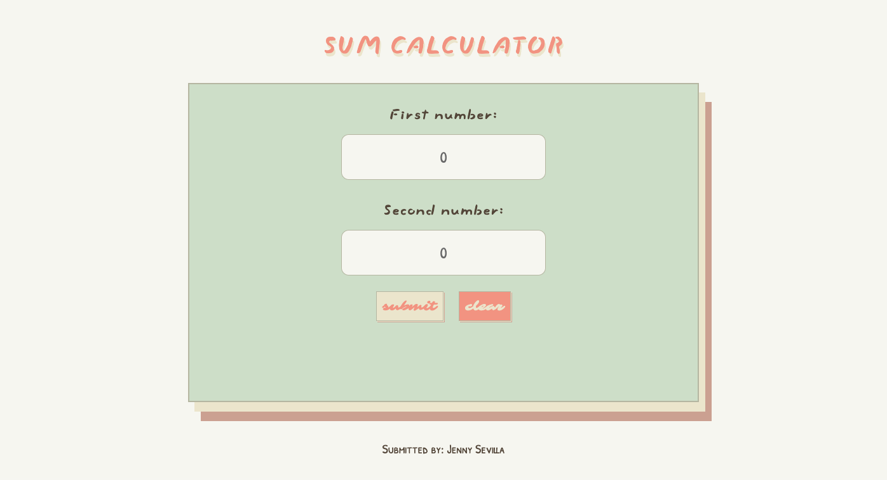
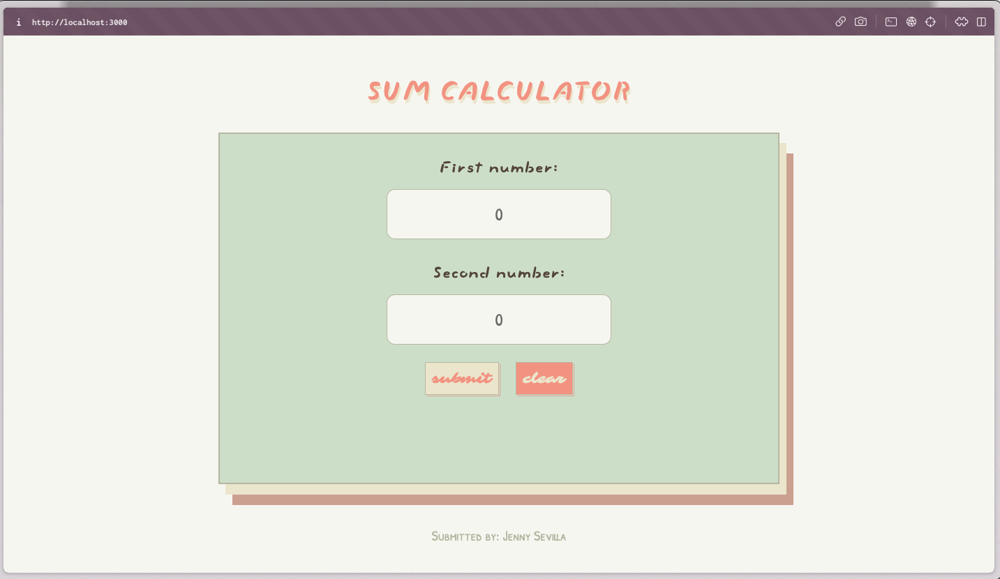
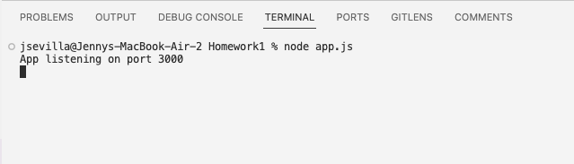

# Sum Calculator Web App
Welcome to the *"Sum Calculator Web App"*, a lightweight and user-friendly tool designed to effortlessly compute the sum of two numeric values. This repository houses the source code for a straightforward yet effective web application.

A live preview of the app can be viewed here: https://homework1-plum.vercel.app/ 

## Features
+ **Input Interaction:** The app provides a seamless user experience by allowing input of two numeric values through designated input fields.

+ **Instant Calculation:** Upon clicking the submit button, the app instantly computes and displays the total sum of the entered values, ensuring a quick and efficient calculation process.

+ **Clear Functionality:** To enhance user convenience, a clear button is available, allowing users to reset both input fields with a single click.

+ **Numeric Input Validation:** The sum calculator enforces precision by accepting only numeric values, ensuring accurate and reliable calculations.



## Requirements

**Express:** The app is built using the Express framework.  
**Node.js:** Ensure that Node.js is installed on your system.

> [!IMPORTANT]  
> Please ensure that you have Express and Node.js installed on your system.

### Usage

1. Enter numeric values in the input fields.
2. Click the `submit` button to calculate the sum.
3. Use the `clear` button to reset both input fields.

## Dependencies  
To generate a list of dependencies. Please run this code using the command line. 

```
npm list --depth=0
```
Alternatively, information can also be found in **[package.json](https://github.com/jnysevilla/Homework1/blob/70c16e48cd96ecc4bf07c72970f1e8dd3e7cdf07/README.md)** file. 

## Preview




## Quick Demo
Below is a quick demo of how to run the app via a localtunnel.

<video controls src="https://github.com/jnysevilla/Homework1/blob/a4853031137bb81b211f3c488d03970579996fc7/files/demo.mov" type="video/mov" />

